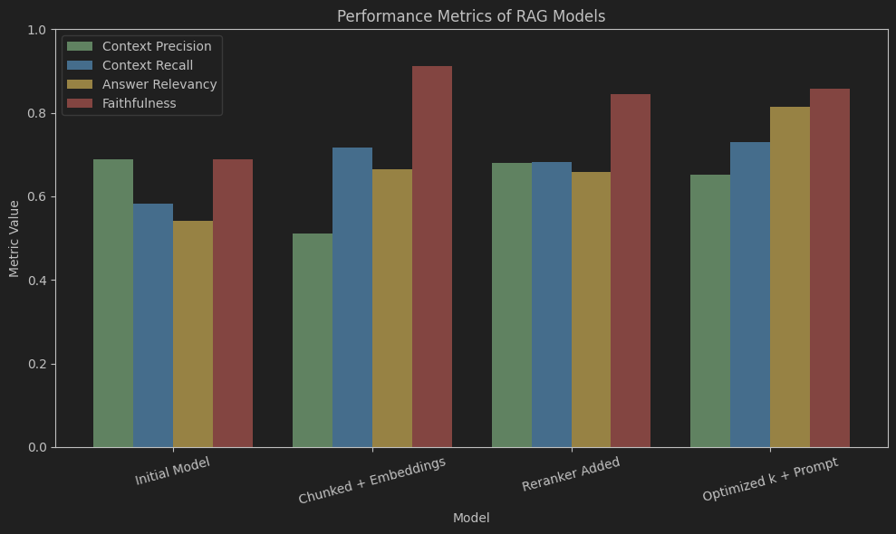

# RAG System Performance Evaluation

## Overview
This project evaluates the performance of four Retrieval-Augmented Generation (RAG) models, each incorporating iterative improvements to enhance context retrieval and answer generation. The models were tested using four key metrics: **Context Precision**, **Context Recall**, **Answer Relevancy**, and **Faithfulness**. The results demonstrate the impact of modifications such as text chunking, new embedding models, reranking, and optimization of k-values and prompts.

## Metrics Description
- **Context Precision**: Proportion of retrieved context that is relevant to the query.
- **Context Recall**: Proportion of all relevant context successfully retrieved.
- **Answer Relevancy**: How well the generated answer aligns with the query in terms of coherence and focus.
- **Faithfulness**: How factually accurate the answer is with respect to the retrieved context.

## Models Evaluated
1. **Initial Model**: Baseline RAG model with no modifications.
2. **Chunked + Embeddings**: Modified to use text chunking and a new embedding model for retrieval.
3. **Reranker Added**: Added a reranker to prioritize relevant context.
4. **Optimized k + Prompt**: Optimized the number of retrieved context items (k-values) and refined the generation prompt.

## Test Results
The performance metrics for each model are summarized below:

| Model                   | Context Precision | Context Recall | Answer Relevancy | Faithfulness |
|-------------------------|-------------------|----------------|------------------|--------------|
| Initial Model           | 0.6889            | 0.5833         | 0.5414           | 0.6889       |
| Chunked + Embeddings    | 0.5105            | 0.7167         | 0.6653           | 0.9127       |
| Reranker Added          | 0.6810            | 0.6833         | 0.6578           | 0.8444       |
| Optimized k + Prompt    | 0.6527            | 0.7300         | 0.8152           | 0.8567       |

### Key Observations
- **Initial Model**: Moderate precision and faithfulness but low recall (58.33%) and poor answer relevancy (54.14%), indicating limited effectiveness.
- **Chunked + Embeddings**: Improved recall (71.67%) and faithfulness (91.27%) significantly, but precision dropped (51.05%) due to more irrelevant context. Answer relevancy improved to 66.53%.
- **Reranker Added**: Restored precision (68.10%) close to the initial model’s level, but recall (68.33%) and answer relevancy (65.78%) slightly regressed, suggesting some relevant context was filtered out.
- **Optimized k + Prompt**: Achieved the best overall performance with the highest recall (73.00%) and answer relevancy (81.52%), strong faithfulness (85.67%), and acceptable precision (65.27%).

## Visualization
A bar chart was created to compare the metrics across the four models using Python with `matplotlib`. The chart uses distinct colors for each metric:
- Context Precision: Green
- Context Recall: Blue
- Answer Relevancy: Amber
- Faithfulness: Red

### Code for Visualization

## Conclusions
- The **Optimized k + Prompt** model outperforms the others, with the highest answer relevancy (81.52%) and context recall (73.00%), making it the most effective for generating relevant and accurate responses.
- Chunking and new embeddings improved recall and faithfulness but reduced precision, indicating a trade-off in retrieving more context.
- The reranker restored precision but slightly reduced recall and relevancy, suggesting over-filtering.
- Optimizing k-values and the prompt balanced precision and recall while significantly boosting answer quality.
